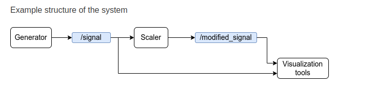

# Sinusoidal Generator – ROS2 Project

## Overview

This ROS2 package implements a simple publisher-subscriber system:

- `signal_generator_node`: Publishes a sinusoidal signal to the `/signal` topic.
- `signal_modifier_node`: Subscribes to `/signal`, scales the value, and republishes it to `/modified_signal`.

You can visualize both signals in real time using `rqt_plot`.


## Package Structure

- `sinusoidal_generator/`: Source code directory
- `launch/`: Launch files (optional)
- `config/`, `resource/`, `test/`: Standard ROS2 package directories
- `package.xml`, `setup.py`, `setup.cfg`: Package metadata and install config

## How to Use

1. **Build the package** inside your ROS2 workspace:
   ```bash
   cd ~/ros2_ws
   colcon build --packages-select sinusoidal_generator
   source install/setup.bash
   ```

2. **Run the signal generator node**:
   ```bash
   ros2 run sinusoidal_generator signal_generator_node
   ```

3. **Run the signal modifier node**:
   ```bash
   ros2 run sinusoidal_generator signal_modifier_node
   ```

4. **Visualize both signals with**:
   ```bash
   rqt_plot
   ```
   Plot `/signal` and `/modified_signal` to observe the original and scaled waveforms.

